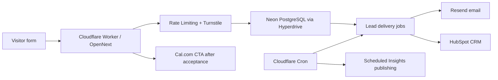

# Taskcover Agency — Site Architecture

This is the planned sitemap. Not all routes are built yet — Phase 1 (this
commit) ships the homepage and the foundation. Routes marked **(planned)** do
not yet have pages and currently rely on the global layout (header/footer).

## i18n (Task 4A) ✅

The site supports three locales with English as the default (unprefixed):

- `en` — English (default) — `/`, `/services`, `/services/[slug]`
- `fr` — French — `/fr`, `/fr/services`, `/fr/services/[slug]`
- `es` — Spanish — `/es`, `/es/services`, `/es/services/[slug]`

Route prefix is the source of truth for the active locale. See
`docs/I18N_STRATEGY.md`.

- `app/page.tsx` — English homepage
- `app/[locale]/page.tsx` — French/Spanish homepage (generates `fr`, `es`)
- `app/services/page.tsx` — English services hub
- `app/[locale]/services/page.tsx` — French/Spanish services hub
- `app/services/[slug]/page.tsx` — English service detail
- `app/[locale]/services/[slug]/page.tsx` — French/Spanish service detail
- `app/proof/page.tsx` — English proof hub
- `app/proof/[slug]/page.tsx` — English proof detail
- `app/[locale]/proof/page.tsx` — French/Spanish proof hub
- `app/[locale]/proof/[slug]/page.tsx` — French/Spanish proof detail
- `app/sitemap.xml/route.ts` — emits all localized routes with hreflang alternates

## Top-level

- `/` — Homepage ✅ (built)
- `/fr` — French homepage ✅ (built)
- `/es` — Spanish homepage ✅ (built)

## Services ✅ (built)

- `/services` ✅
- `/services/seo-agency` ✅
- `/services/technical-seo` ✅
- `/services/ai-search-optimization` ✅
- `/services/content-marketing` ✅
- `/services/digital-pr-link-building` ✅
- `/services/local-seo` ✅
- `/services/ecommerce-seo` ✅
- `/services/international-seo` ✅
- `/services/ppc-management` ✅
- `/services/seo-mentor-service` ✅
- `/services/seo-audit` ✅

Localized equivalents (`/fr/services/*`, `/es/services/*`) are also built for
all 11 services. Slugs are shared (English) for now; localized slugs are a
future enhancement (see `I18N_STRATEGY.md` §11).

> The hub (`/services`) uses a service constellation + layered capability
> stack + decision guide. Each detail page uses the shared
> `ServicePageTemplate` with 10 distinct sections and a service-specific
> visual. See `docs/HOMEPAGE_VIBE_STANDARD.md` §18.
>
> **Data depth (Task 3C):** All 11 service pages now carry enriched,
> service-specific data across problem, approach, deliverables (with `tag`
> chips), use cases (with `signal` triggers), process (with `timing`), and
> outcomes. Every page also has a service-specific CTA preview panel.
> Pages are ready for i18n.

## Industries ✅ (built)

- `/industries` ✅
- `/industries/travel-seo` ✅
- `/industries/education-seo` ✅
- `/industries/healthcare-seo` ✅
- `/industries/legal-immigration-seo` ✅
- `/industries/saas-seo` ✅
- `/industries/ecommerce-seo` ✅
- `/industries/franchise-local-seo` ✅

Localized equivalents (`/fr/industries/*`, `/es/industries/*`) are also built for
all 7 industries. Slugs are shared (English) for now; localized slugs are a
future enhancement (see `I18N_STRATEGY.md` §11).

> The hub (`/industries`) uses a sector signal dashboard + interactive sector
> rail + comparison matrix + service bundle rails. Each detail page uses the
> shared `IndustryPageTemplate` with 9 distinct sections and an
> industry-specific visual. Travel and Education are flagged as priority
> sectors with relevant team/partner experience context. See
> `docs/HOMEPAGE_VIBE_STANDARD.md` §19.
>
> **Credibility rules:** No fabricated metrics, testimonials, case-study
> numbers, or fake proof. Brand names (Agoda, Skyscanner, British Council) are
> referenced only as selected team/partner experience context — never as
> endorsement.

## Markets ✅ (built)

- `/markets` ✅
- `/markets/usa-seo-agency` ✅
- `/markets/canada-seo-agency` ✅
- `/markets/australia-seo-agency` ✅

Localized equivalents (`/fr/markets/*`, `/es/markets/*`) are also built for
all 3 markets. Slugs are shared (English) for now; localized slugs are a
future enhancement (see `I18N_STRATEGY.md` §11).

> The hub (`/markets`) uses a global market command dashboard + interactive
> regional selector + comparison matrix + stacked regional growth playbooks.
> Each detail page uses the shared `MarketPageTemplate` with 11 distinct
> sections and a market-specific regional intelligence visual. See
> `docs/HOMEPAGE_VIBE_STANDARD.md` §20.
>
> **Market page adaptation rules:**
> - Market pages **must** differentiate regional search behavior, trust
>   signals, local/national opportunities, PPC demand capture, and AI search
>   readiness — never duplicate content with the country name swapped
>   (doorway-page behavior).
> - Market page two-column sections **must** include meaningful secondary
>   panels (fit summary, leverage panel, angle cards) to avoid empty visual
>   space beside section headings.
>
> **Credibility rules:** No fabricated metrics, testimonials, case-study
> numbers, awards, or fake proof. Taskcover is positioned as serving clients
> in USA, Canada, and Australia — not necessarily headquartered there. Safe
> wording only: "Selected team and partner experience across global brands,
> campaigns, and search programs."

## Proof + Authority ✅ (built)

- `/proof` ✅
- `/proof/brand-experience` ✅
- `/proof/media-features` ✅
- `/proof/client-reviews` ✅
- `/proof/video-reviews` ✅
- `/proof/spokesperson` ✅

Localized equivalents (`/fr/proof/*`, `/es/proof/*`) are also built for all 5
proof detail pages. Slugs are shared (English) for now.

> Proof pages use `src/content/proof.registry.ts` plus public-only helper
> filters in `src/lib/content.ts`. Empty public registries render evidence
> standards and private-reference pathways, not fake testimonials, press,
> videos, logos, ratings, awards, or case-study metrics. See
> `docs/PROOF_AND_AUTHORITY_STANDARD.md`.

## Work ✅ (built)

- `/work` ✅
- `/work/case-studies` ✅
- `/work/sample-audits` ✅
- `/work/sample-audits/technical-seo-audit` ✅
- `/work/sample-audits/ai-search-visibility-review` ✅
- `/work/sample-audits/content-gap-map` ✅
- `/work/sample-audits/local-seo-audit` ✅
- `/work/sample-audits/ecommerce-search-architecture` ✅
- `/work/sample-audits/international-seo-market-map` ✅
- `/work/sample-audits/ppc-organic-intelligence` ✅
- `/work/sample-audits/90-day-search-growth-roadmap` ✅
- `/work/search-growth-frameworks` ✅
- `/work/client-results` ✅

Localized equivalents (`/fr/work/*`, `/es/work/*`) are also built for the Work
hub, all four channel pages, and all 8 sample-audit detail pages. Slugs remain
English for now.

> Work pages use `src/content/work.registry.ts` plus public-only helper
> filters in `src/lib/content.ts`. Empty public case-study and result
> registries render publication standards, methodology, private-reference
> handling, and evidence requirements, not fake case studies, fake metrics, or
> anonymous success stories. See `docs/WORK_AND_CASE_STUDY_STANDARD.md`.

### Task 8B Case Study Detail Routes

Task 8B publishes 10 verified public Taskcover Agency case studies:

- `/work/case-studies/british-university-vietnam`
- `/work/case-studies/casa-madera`
- `/work/case-studies/the-bamboo-bar`
- `/work/case-studies/matthew-jeffery-law-firm`
- `/work/case-studies/skatepro`
- `/work/case-studies/agoda`
- `/work/case-studies/avis`
- `/work/case-studies/novaworld`
- `/work/case-studies/ccleaner`
- `/work/case-studies/fwd-insurance`

Localized equivalents exist under `/fr/work/case-studies/[slug]` and
`/es/work/case-studies/[slug]`, with English slugs preserved across locales.
The 30 case-study detail routes are statically generated and included in the
sitemap with localized hreflang alternates.

## Methodology & technology `(planned)`

- `/methodology`
- `/technology`

## Insights `(planned)`

- `/insights` (index)
- `/insights/[slug]` (article detail with `Article` schema)

## Conversion `(planned)`

- `/free-seo-audit`
- `/book-a-call`
- `/contact`
- `/thank-you`

## Notes

- Use Next.js App Router conventions: `app/<route>/page.tsx`.
- Use `buildMetadata({ path, locale })` from `src/lib/seo.ts` for canonical,
  OG, Twitter, and hreflang alternates. The helper localizes the path.
- Add `BreadcrumbList` schema via `breadcrumbSchema(items, locale)` where
  appropriate — it localizes both labels' paths.
- Content is accessed via `src/lib/content.ts` accessors
  (`getHomeContent`, `getServicesContent`, `getServiceBySlug`, etc.), never
  via raw imports of locale files.
- The header/footer derive locale from the route prefix via `useLocale()`.
- The language switcher preserves the equivalent page path across locales.
- Internal links from the footer (`src/components/marketing/layout/site-footer.tsx`)
  are localized automatically for the active locale.
- See `docs/I18N_STRATEGY.md` for the full multilingual strategy.

## Lead Funnel (Task 9)

Built localized lead funnel routes:

- `/free-seo-audit`, `/fr/free-seo-audit`, `/es/free-seo-audit`
- `/book-a-call`, `/fr/book-a-call`, `/es/book-a-call`
- `/contact`, `/fr/contact`, `/es/contact`
- `/contact?intent=media`, `/contact?intent=private-reference`, `/contact?intent=partnership`
- `/thank-you?type=seo-audit`, `/thank-you?type=strategy-call`, `/thank-you?type=contact`

Indexable funnel pages are included in sitemap. Thank-you pages are built,
marked `noindex`, and excluded from sitemap. Submissions use
`src/app/api/leads/route.ts` and require at least one configured delivery
adapter before redirecting to thank-you. See `docs/LEAD_FUNNEL_STANDARD.md`.
## Task 10: Insights Engine

The public Insights system lives under `/insights` with localized mirrors under `/fr/insights` and `/es/insights`. Category slugs remain English across locales:

- `/insights/seo-guides`
- `/insights/ai-search`
- `/insights/technical-seo`
- `/insights/content-authority`
- `/insights/local-international-seo`
- `/insights/ppc-search-intelligence`
- `/insights/seo-mentor`

Article routes use `/insights/[categorySlug]/[articleSlug]` and localized equivalents. All routes are statically generated from `InsightsProvider`; public rendering, sitemap, related content, and search/filter metadata use only published articles.

The provider-neutral architecture is documented in `docs/INSIGHTS_CONTENT_STANDARD.md`. Future Admin requirements are documented in `docs/ADMIN_CONTENT_SPEC.md`.

## Admin Content OS (Task 10B)

Admin routes live under `/admin` and are excluded from public navigation and marked `noindex`.

- `/admin/login`
- `/admin/accept-invite`
- `/admin`
- `/admin/insights`
- `/admin/insights/new`
- `/admin/insights/[id]`
- `/admin/insights/[id]/preview`
- `/admin/media`
- `/admin/users`
- `/admin/audit-log`
- `/admin/settings/integrations`
- `/admin/settings/publishing`

The secure scheduler endpoint is `POST /api/internal/publishing/run`.
## Task 11 Production Layer

Production hosting is Cloudflare Workers through OpenNext for Cloudflare. Runtime data flows use Neon PostgreSQL via Hyperdrive. The lead funnel writes first to Neon, creates outbox jobs transactionally, and then uses Cron-driven retries for Resend and HubSpot.

Cloudinary uploads are signed server-side. Admin and preview content stay noindex/private.

## Task 12 Trust, Legal, and Visitor Readiness

Built localized routes:

- `/about`, `/fr/about`, `/es/about`
- `/methodology`, `/fr/methodology`, `/es/methodology`
- `/how-we-work`, `/fr/how-we-work`, `/es/how-we-work`
- `/privacy-policy`, `/fr/privacy-policy`, `/es/privacy-policy`
- `/cookie-policy`, `/fr/cookie-policy`, `/es/cookie-policy`
- `/terms`, `/fr/terms`, `/es/terms`
- `/accessibility`, `/fr/accessibility`, `/es/accessibility`
- `/data-request`, `/fr/data-request`, `/es/data-request`
- `/cookie-preferences`, `/fr/cookie-preferences`, `/es/cookie-preferences`

These pages use localized metadata, canonical URLs, hreflang alternates,
BreadcrumbList schema, and sitemap inclusion. Legal copy is a website-ready
draft and requires final legal review before launch.

## Task 13 Commercial SEO Architecture

Commercial SEO ownership is documented in:

- `docs/COMMERCIAL_SEO_ARCHITECTURE.md`
- `docs/COMMERCIAL_SEO_URL_INVENTORY.md`
- `docs/KEYWORD_TO_URL_MAP.md`
- `docs/CANNIBALIZATION_AUDIT.md`
- `docs/COMMERCIAL_PAGE_GAP_ANALYSIS.md`
- `docs/INTERNAL_LINKING_ARCHITECTURE.md`
- `docs/SEM_LANDING_PAGE_READINESS.md`
- `docs/COMMERCIAL_READINESS_REPORT.md`

The canonical commercial architecture is intentionally conservative: existing
service, industry, and market pages own the major keyword families. No
root-level duplicate commercial pages, city pages, doorway pages, or
swapped-location pages were added. The typed source for future QA is
`src/content/seo/url-intent-map.ts`.

## Task 13B Global Navigation Polish

Task 13B changed global information architecture only. It did not create,
delete, merge, noindex, canonicalize, or redirect routes.

Header top-level IA is now:

- Services
- Solutions
- Work
- Insights
- Company

Solutions groups the existing Industries and Markets routes. Work groups the
existing Work and Proof routes plus the private-reference contact intent. The
footer groups Services, Solutions, Work, Insights, Company, and Legal.

Localized navigation data lives in `src/content/{en,fr,es}/site.ts`, and
`getLocalizedSite()` applies `/fr` and `/es` prefixes while preserving English
slugs.

## Task 13C Architecture Preservation

Task 13C is a UI/content proof polish pass only. It does not create public routes, delete routes, change canonical or hreflang behavior, change sitemap inclusion rules, add analytics, add a cookie banner, deploy production, or change DNS. English route slugs remain shared across localized routes.
## Pricing Page

The localized pricing route lives at `/pricing`, `/fr/pricing`, and
`/es/pricing`. Slugs remain English for all locales.

Pricing is a decision-stage commercial page, not a duplicate service page. It
links visitors toward Free SEO Audit and Strategy Call paths, explains Local /
National / Global / SEO Mentor / Audit / PPC starting prices, and preserves the
global canonical, hreflang, and sitemap strategy.

See `docs/PRICING_PAGE_STANDARD.md` for the pricing model and scope rules.

## About Story Page

The localized About route lives at `/about`, `/fr/about`, and `/es/about`.
Slugs remain English for all locales.

The page uses a dedicated story renderer and localized content in
`src/content/about-story.ts`, while preserving the existing canonical,
hreflang, sitemap, and BreadcrumbList patterns. It does not create new routes.

The public story is limited to the confirmed 2017 Southeast Asia white-label
origin, 2018 repeatable delivery systems, 2019 commercial direction toward
Canada and the United States, today's USA/Canada/Australia positioning, and
the confirmed leadership entries for Jamiez Nguyen and John Edward. See
`docs/ABOUT_STORY_STANDARD.md`.

## Task 14 Technical SEO Route Inventory

Task 14 confirms the launch sitemap inventory at 243 canonical localized public
URLs. `npm run build` currently generates 264 static pages, including
`/robots.txt` and `/sitemap.xml`, plus dynamic Admin, API, contact, pricing, and
thank-you routes.

Route families and indexability rules are documented in
`docs/TECHNICAL_SEO_URL_INVENTORY.md`.

`src/app/robots.ts` now emits robots rules for launch crawler guidance. Admin,
API, preview, thank-you, 404/error, draft, and query URLs remain excluded from
the sitemap. Pricing query URLs such as `?tab=mentor` remain routable but
canonicalize to the clean localized pricing route.

## Task 15 Launch QA Tooling

Task 15 adds `scripts/launch-qa.ts` and four local scripts:

- `npm run perf:check`
- `npm run a11y:check`
- `npm run visual:check`
- `npm run launch:qa`

The script performs source-level public bundle, media, accessibility, motion,
and responsive guardrails. It can also sample rendered routes when passed
`-- --base-url=http://localhost:3100`. These checks supplement, not replace,
`seo:check`, `seo:crawl`, production build, and Cloudflare dry-run gates.
